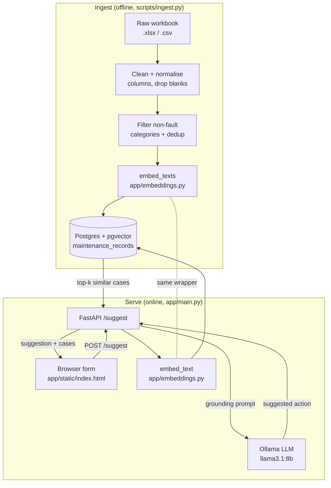

# Knowledge Box — Project Report

**A self-hosted retrieval-augmented generation (RAG) microservice for
suggesting remedial actions to maintenance call-outs in Ei Electronics.**

Author: Darren Heffernan
Date: 27 July 2026

---

## 1. Abstract

Knowledge Box is a retrieval-augmented generation (RAG) microservice that,
given a free-text description of a production-line fault, suggests a concise
remedial action grounded in a corpus of roughly 80k historical maintenance
call-outs in Ei Electronics. It embeds the incoming fault description with a sentence-transformer
model, retrieves the most similar historical faults from a Postgres/pgvector
index, and passes those retrieved cases as grounding context to a locally
served large language model (LLM) via Ollama, which synthesises a suggested
fix.

The entire pipeline is self-hosted: no fault data or query ever leaves the
local environment, and no external LLM API is called. This was a hard
requirement, driven by the commercially sensitive nature of the maintenance
data. The system has been validated end to end against the real anonymised
workbook (80,117 raw rows reduced to 59,063 indexed records after cleaning,
category filtering and deduplication).

---

## 2. Problem statement and motivation

On a production line, when a unit fails a test or a machine faults, an engineer
is called out to diagnose and fix it. The fix is logged: a short free-text
fault description ("Sound fail on final test, speaker output silent") and the
remedial action taken ("Replaced faulty speaker module, RTV to supplier").
Since 2020, approx. 80k of these fault/fix pairs have been collected into a 
large maintenance workbook.
That history is valuable but effectively inaccessible. It lives in a
spreadsheet, and the only way to benefit from it is if the engineer on shift
happens to remember that a near-identical fault was resolved a certain way
months ago. New or less experienced engineers cannot draw on it at all. The
same faults get re-diagnosed from scratch.

The goal of Knowledge Box is to make that accumulated history queryable in
natural language. An engineer describes the fault in their own words and
immediately sees both (a) the historical call-outs most similar to it, with the
actions that resolved them, and (b) a synthesised suggested action. ts value
lies less in producing a definitive answer than in surfacing relevant 
institutional memory at the point of need, with the supporting cases attached 
so the engineer can assess it independently.

### Why RAG rather than a fine-tuned or plain LLM

- A plain LLM has no knowledge of Ei Electronics' machines' faults, part numbers, test
  stations or conventions, and would hallucinate plausible-but-wrong fixes.
- Fine-tuning a model on the workbook would bake the data into weights, is
  expensive to repeat as data grows, and still gives ungrounded, untraceable
  output.
- RAG keeps the data in a queryable index, cites the exact rows a suggestion is
  grounded in, and updates simply by re-running ingest. It is the right fit for
  "answer using this specific, changing, proprietary corpus."

---

## 3. Requirements and constraints

The constraints below shaped almost every design decision and are recorded here and in
`docs/decisions.md`.

| # | Constraint | Rationale / consequence |
|---|---|---|
| C1 | **Fully self-hosted. No external LLM APIs anywhere in the pipeline.** | The maintenance data is commercially sensitive; it cannot be sent to a hosted API. Forces a local embedding model + a locally served LLM (Ollama). |
| C2 | **Git tracks code and config only — never data or secrets.** | The real workbook and `.env` must not enter version control. The DB and model artifacts rebuild locally from `ingest.py`, so any machine can be reconstructed from git + the raw workbook alone. `data/sample.csv` (synthetic) is the one tracked data file. |
| C3 | **All embedding calls go through one wrapper function.** | A fine-tuning swap is anticipated. Routing every embed call through `app/embeddings.py` means the model can change in one place without touching index-time or query-time call sites, and keeps the two consistent by construction. |
| C4 | **Non-fault categories are filtered at index time.** | Categories like Changeover, Operator Error, No fault found, Preventative Maintenance and Call out cancelled do not represent a fault→fix pattern worth retrieving, and would pollute results. |
| C5 | **Runs across two machines** — a laptop for code, a Docker host for the runtime (GPU optional, for performance; the stack runs CPU-only today). | See §7. Reinforces C2: the split only works because nothing but code/config is synced. |

---

## 4. System architecture

Knowledge Box is a small FastAPI service in front of two stateful backing
services (a pgvector-enabled Postgres and an Ollama model server), fed by an
offline ingest pipeline.




**Key point:** the embedding wrapper (`app/embeddings.py`) is shared by both
the offline ingest path and the online query path (dashed link above). This is
constraint C3 realised in code — index-time and query-time text is guaranteed
to be embedded by the identical model, which is what makes similarity search
meaningful.

### Component summary

| Component | File | Responsibility |
|---|---|---|
| Ingest pipeline | `scripts/ingest.py` | Load workbook → clean → filter → embed → upsert into Postgres |
| Embedding wrapper | `app/embeddings.py` | Single choke point turning text into normalised vectors |
| DB connection helper | `app/db.py` | Single choke point for Postgres connection parameters, shared by ingest and the API |
| API service | `app/main.py` | `POST /suggest`: embed query → retrieve → prompt LLM → return |
| Frontend | `app/static/index.html` | Plain HTML/JS form, served by FastAPI, no build step |
| Backing services | `docker-compose.yml` | pgvector Postgres + Ollama (and, in the `full` profile, the API) |

---

## 5. Data pipeline (ingest)

`scripts/ingest.py` is an idempotent batch job: raw workbook in, embedded
Postgres index out. It runs directly (`python scripts/ingest.py`) and can be
re-run safely at any time.

### 5.1 Loading and column normalisation

The single hardest part of ingest is that real-world exports have messy,
inconsistent headers. The clean schema uses names like `bay`,
`product_family`, `fault_description`, `time_to_resolve_mins`; the real
workbook uses `Bay #`, `Product`, `Call out Fault \ Description`,
`Time to resolve (mins)`.

Two mechanisms handle this:

1. **Generic punctuation stripping:** `_clean_column_name` collapses any run of
   non-alphanumeric characters to a single underscore and lower-cases the
   result. This resolves `Bay #` → `bay` and `Time to resolve (mins)` →
   `time_to_resolve_mins` for free, regardless of the exact punctuation.
2. **Explicit aliases for semantic renames** that stripping cannot infer —
   `COLUMN_ALIASES` maps `product` → `product_family` and the
   fault-description column → `fault_description`.

The design intent (documented in `decisions.md`) is that a future export with
different wording should be accommodated by extending the alias dict, not
changing the schema. Required columns (`fault_description`,
`remedial_action`, `category`) that are still missing after normalisation raise
a clear error listing the columns that *were* found; optional columns are
filled with nulls.

### 5.2 Cleaning and filtering

`_clean` then:

- strips whitespace and drops rows with an empty `fault_description` or
  `remedial_action` (a row with no fault or no fix is not a usable case);
- **filters out non-fault categories** (constraint C4) —
  Changeover, Operator Error, No fault found, Preventative Maintenance,
  Call out cancelled;
- coerces `date` and `time_to_resolve_mins` to proper types, tolerating bad
  values via `errors="coerce"`.

Every step logs how many rows it dropped, so an operator running ingest sees
exactly where rows went.

### 5.3 Deduplication

The table's primary key is a `row_hash` — a SHA-256 over
date/shift/bay/cell/fault_description/remedial_action. Combined with the
`ON CONFLICT (row_hash) DO UPDATE` upsert, this makes ingest idempotent and
collapses exact-duplicate call-out entries in the source. On the real workbook
this collapsed 253 rows; spot-checking confirmed these were genuine duplicate
entries, not distinct incidents being lost.

### 5.4 Embedding and storage

Fault descriptions are embedded in a batch via `embed_texts`, and rows +
vectors are upserted into `maintenance_records`. The schema is created if
absent, including the pgvector extension and an HNSW index with
`vector_cosine_ops` for approximate-nearest-neighbour search. Embeddings are
L2-normalised, so cosine distance and inner product agree.

---

## 6. Retrieval and generation (the `/suggest` path)

`app/main.py` exposes `POST /suggest`. Given a `SuggestRequest`
(`fault_description`, optional `product_family` / `test_station`, and `top_k`
bounded to 1–20), the handler:

1. Embeds the query via `embed_text` with the same wrapper used at index time
   (C3).
2. Retrieves the `top_k` most similar rows with a pgvector similarity
   query, ordering by `embedding <=> %s::vector` (cosine distance). The
   explicit `::vector` cast is needed, without it Postgres cannot infer
   the parameter type and raises `operator does not exist: vector <=>
   double precision[]`.
3. Builds a grounding prompt (`_build_prompt`) that lays out the retrieved
   fault/fix pairs as numbered context, appends any optional
   product-family/test-station context, and asks the model for a concise
   remedial action grounded in those resolutions.
4. Generates the suggestion by calling the local Ollama `/api/generate`
   endpoint (`_generate_suggestion`). If Ollama is unreachable it returns a
   clean `502` naming the host, rather than a stack trace.
5. Returns the `suggested_action` together with the full list of
   `supporting_cases` — including each case's cosine distance, which the
   frontend renders as a "% match".

Returning the supporting cases is a core design choice. An engineer can see the historical rows it was built from and
decide for themselves whether to trust it.

### Reliability details

- **Startup warm-up.** A FastAPI `lifespan` handler warms both the embedding
  model and the Ollama model at startup, so the first real request is not
  penalised by cold-loading a multi-GB model. Startup therefore takes 30–90s;
  this is intentional and documented.
- **Generous timeout.** Ollama calls use a 300s timeout. On CPU-only hardware
  the first generation is genuinely slow, and a client giving up early would
  otherwise abort the model load entirely.
- **Empty-index guard.** If no records are indexed yet, `/suggest` returns a
  `404` telling the caller to run ingest first, rather than failing obscurely.

---

## 7. Deployment and the two-machine workflow

Because git carries only code and config (C2), the system runs cleanly across
two machines:

- **Machine A (laptop)** — write code, commit, push. No data, no `.env`, no
  containers needed.
- **Machine B (Docker host; GPU optional)** — pull, copy `.env.example` to `.env`, drop
  the real workbook under `data/raw/`, `docker compose up -d`, then
  `python scripts/ingest.py` to rebuild Postgres + embeddings locally.

Either machine can be wiped and reconstructed from git plus the raw workbook,
because the DB and models are rebuilt, never synced.

For a shared-server deployment (so colleagues on the office network can reach
the API), `docker-compose.yml` defines a `full` profile that additionally
containerises the FastAPI app (`Dockerfile`). Local dev keeps running uvicorn
in a venv against just the DB and Ollama; the server runs everything in
containers. The `app` service overrides `POSTGRES_HOST`/`OLLAMA_HOST` to the
container network names, so a single `.env` works in both cases. See
`docs/deployment.md` for the full walkthrough.

**Security posture (deliberately honest).** In the shared-server setup, the DB
(5432) and Ollama (11434) ports are bound to `127.0.0.1` only, so they are not
reachable across the LAN — this matters because Postgres ships with the default
`kbox`/`kbox` credentials. Only the app's port 8000 is published network-wide.
However, `POST /suggest` currently has no authentication: anyone who can
reach the host on port 8000 can query it and, by extension, the maintenance
history it is grounded in. This is called out in `docs/deployment.md` as
something to resolve (an API-key check or similar) before any exposure beyond a
trusted network, and is listed again under Limitations below.

---

## 8. Evaluation

Evaluation to date is qualitative and operational*rather than a formal
quantitative benchmark. This is the honest state of the project and is
revisited under Limitations.

What has been validated:

### 8.1 End-to-end run on the real corpus

The full pipeline was run against the real anonymised workbook:

| Stage | Rows |
|---|---|
| Raw rows loaded | 80,117 |
| After cleaning (blank fault/fix dropped) + non-fault category filter | ~59k |
| After row-hash deduplication (253 exact duplicates collapsed) | **59,063 indexed** |

The pipeline completes end to end, the index builds, and `/suggest` returns
grounded suggestions with supporting cases.

### 8.2 Retrieval quality — what works and what doesn't

Retrieval was inspected by hand across a range of queries. The key finding,
recorded in `decisions.md`:

- **Strong when the query is phrased like the historical logs.** Terse
  component-code shorthand retrieves near-identically — e.g. `"Failed on CR51"`
  matched a historical entry at cosine distance ≈ 0.
- **Weaker for natural-language paraphrases of code-heavy categories.** A
  plain-English rephrasing of a terse, code-laden category such as
  `Contact problem` retrieves less reliably, because the sentence-transformer
  embedding of prose is not close to the embedding of shorthand like "CR51".

This is a property of a general-purpose embedding model on
domain shorthand and is the motivation for the planned
fine-tuning swap that constraint C3 was designed to make cheap (see Future
work).

### 8.3 Design-level validation

- **Idempotency** of ingest was confirmed: re-running rebuilds from source via
  the upsert without a fresh database.
- **Deduplication correctness** was spot-checked: the 253 collapsed rows were
  all true duplicates.
- **Category filtering** is demonstrated even on `data/sample.csv`, which
  deliberately includes a few rows in each filtered-out category so the filter
  can be seen to work.

### 8.4 Unit tests

The pure-Python cleaning and normalisation logic is covered by a `pytest`
suite in `tests/` that runs with no Docker, database or model required. It
exercises header normalisation, the alias map, missing-required-column errors,
blank-row dropping, non-fault category filtering, and the row-hash. See §10.

---

## 9. Key design decisions and trade-offs

These are drawn from `docs/decisions.md`, the append-only log kept as the
project evolved.

1. **Self-hosted everything (C1).** Trade-off: local Ollama on CPU is slow
   (tens of seconds per generation) and the operator must manage model pulls
   and a GPU host for good performance. Accepted because sending fault data to
   a hosted API was never an option.
2. **Single embedding wrapper (C3).** Trade-off: none material; a small
   indirection that buys guaranteed index/query consistency and a one-line
   model swap later.
3. **Filter non-fault categories at index time, but do not over-filter (C4).**
   The real taxonomy is far more granular than the five filtered categories and
   includes mixed-content categories (`Cell set-up`, `New line set-up`) that
   contain real troubleshooting narratives alongside setup logistics. Decision:
   do not expand the filter list, because filtering a whole category would
   discard genuine fault/fix content along with the noise. Revisit only if
   retrieval quality demonstrably suffers.
4. **Frontend served by FastAPI, not a second framework.** The demo UI is a
   single static HTML/JS page served via `StaticFiles`. Standing up a separate
   Flask service would mean another process, port and container for no benefit;
   FastAPI serves HTML fine. Revisit only if the frontend must be deployed
   independently of the API.
5. **HNSW index with cosine ops + normalised embeddings.** Approximate NN keeps
   retrieval fast at ~59k rows and scales further; normalisation makes cosine
   the natural metric.
6. **`row_hash` primary key for idempotent upsert.** Makes ingest safely
   re-runnable and deduplicates the source in one mechanism.

---

## 10. Running the project

Full instructions are in `README.md` and `docs/setup.md` (which includes a
troubleshooting table). In brief:

```bash
docker compose up -d                 # Postgres/pgvector + Ollama
cp .env.example .env
python -m venv .venv && source .venv/Scripts/activate
pip install -r requirements.txt
docker exec kb-ollama-1 ollama pull llama3.1:8b
python scripts/ingest.py             # builds the index (sample data by default)
uvicorn app.main:app --reload        # serves the API + frontend
```

Then open `http://127.0.0.1:8000/` for the form, or `/docs` for Swagger.

### Running the tests

The unit tests need no Docker, DB or model:

```bash
pip install -r requirements-dev.txt
pytest
```

They cover the ingest cleaning/normalisation/filtering logic in
`scripts/ingest.py`.

---

## 11. Limitations and known issues

1. **No formal quantitative retrieval evaluation.** Evaluation is qualitative
   (hand-inspected retrievals) plus operational validation. There is no
   labelled test set, no precision@k / recall figures, and no measurement of
   suggestion quality against ground truth.
2. **Retrieval is style-sensitive.** Prose queries against code-heavy shorthand
   categories retrieve poorly (§8.2). A general-purpose embedding model is not
   tuned to this domain's vocabulary.
3. **No authentication on `/suggest`.** Anyone who can reach the port can query
   the service and its grounding data (§7). Needs an API key or similar before
   any non-trivial exposure.
4. **Default database credentials.** `kbox`/`kbox` from `.env.example` are fine
   for local dev and are mitigated by binding the DB to localhost only, but
   must be changed for any shared deployment.
5. **CPU latency.** Without a GPU, first-request and cold generations take tens
   of seconds. Managed with warm-up and a 300s timeout, but the UX depends on
   suitable hardware.
6. **Suggestion quality is bounded by the corpus and the 8B model.** For faults
   with no similar history, the model has little to ground on; the returned
   cases (with their match %) are the honest signal of how much to trust a
   given answer.

---

## 12. Future work

1. **Fine-tune the embedding model** on the maintenance corpus so domain
   shorthand and prose paraphrases land near each other in vector space. The single-wrapper design (C3) exists
   precisely to make this a one-module change.
2. **Add a formal evaluation harness** — a labelled query→expected-case set to
   produce precision@k / recall numbers and to measure the impact of the
   fine-tuning swap objectively.
3. **Authentication and secret management** on the API and database before any
   wider rollout.
4. **Metadata-filtered retrieval** — let `product_family` / `test_station`
   (already accepted in the request) constrain the similarity search, not just
   flavour the prompt.
5. **Feedback loop** — let engineers mark whether a suggestion helped, building
   the labelled data that (1) and (2) need.
6. **GPU-backed Ollama host** for production-grade latency.

---

## 13. Conclusion

Knowledge Box turns a large, static maintenance workbook into a natural-language
question-answering tool that surfaces the most relevant historical call-outs and
a grounded suggested fix, entirely within a self-hosted boundary that keeps
commercially sensitive data local. The architecture is small : a single shared embedding wrapper, a pgvector similarity index, a local
LLM for synthesis, and traceable supporting cases returned with every answer.

---

## Appendix A — Repository layout

```
scripts/ingest.py        Excel/CSV -> clean -> Postgres + embeddings
app/main.py              FastAPI service (POST /suggest, serves the frontend)
app/embeddings.py        Shared embedding wrapper (index-time and query-time)
app/db.py                Shared Postgres connection helper
app/static/index.html    Form-based frontend (fault input -> suggestion + cases)
tests/                   pytest suite for the ingest cleaning logic
docs/report.md           This report
docs/setup.md            Detailed setup walkthrough + troubleshooting
docs/deployment.md       Shared-server (containerised) deployment guide
docs/decisions.md        Append-only decisions log
data/sample.csv          Synthetic sample data (tracked in git)
data/raw/                Real workbook goes here (git-ignored)
docker-compose.yml       Postgres/pgvector + Ollama (+ app under `full` profile)
Dockerfile               Container image for the API service
```

## Appendix B — `POST /suggest` reference

Request:

```json
{
  "fault_description": "Unit will not power on, seems to have a blown fuse",
  "product_family": "ProLine-X",   // optional
  "test_station": "EOL-1",          // optional
  "top_k": 5                          // 1..20, default 5
}
```

Response:

```json
{
  "suggested_action": "Replace the blown control-board fuse (e.g. F3) and retest ...",
  "supporting_cases": [
    {
      "fault_description": "Unit dead on power up blown fuse F3 on control board",
      "remedial_action": "Replaced F3 2A fuse on control board and retested",
      "category": "Electrical",
      "bay": "Bay 3", "cell": "Cell 2",
      "product_family": "ProLine-X", "test_station": "EOL-1",
      "distance": 0.04
    }
  ]
}
```

`distance` is cosine distance (lower = more similar); the frontend renders it
as `round((1 - distance) * 100)`% match, clamped at 0 (cosine distance can
exceed 1, which would otherwise yield a negative percentage).
